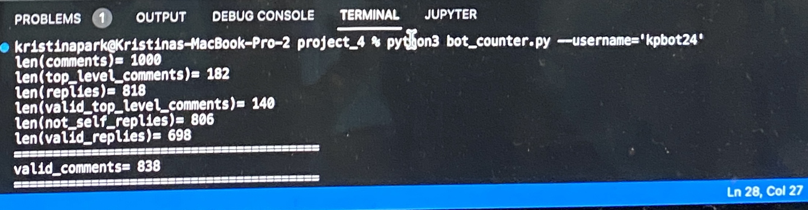
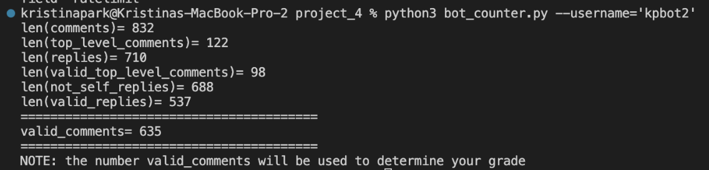
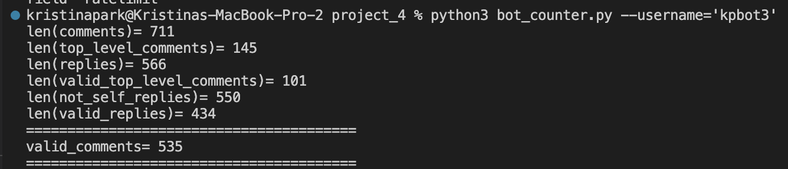
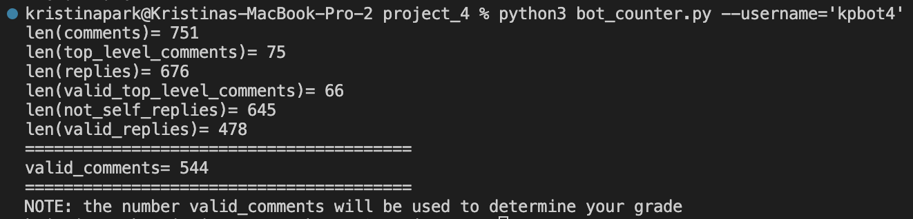

# project_4

Below is a photo of the results of running `bot_counter.py` on my `bot.py`. The number of valid comments came out to be 838.

Below are screenshots of my 4 other bots that reached 500+ valid comments

I got 12 points from `bot.py`, 6 points from the `valid_comments` section, 3 points from the Github repo, 2 points from the `bot_submissions.py` section, 2 points from the "army" of 5 bots sections, 2 points from the upvote sections, 2 points from teh `bot_vote.py` section, and 5 points from the Markovify section. 
All these points add up to 34, which means that I should receive 34/25 for this project.
