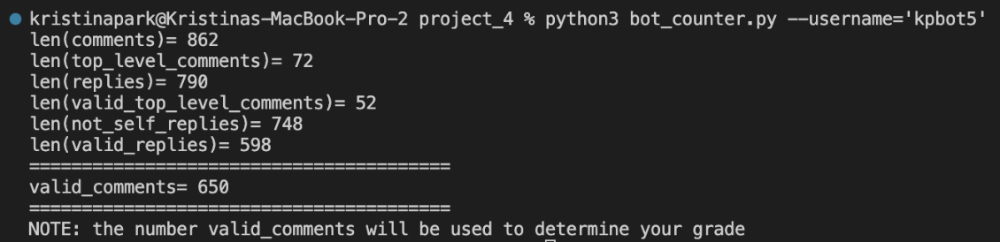

# project_4


Below is a photo of the results of running `bot_counter.py` on my `bot.py`. The number of valid comments came out to be 838.


Below are screenshots of my 4 other bots that reached 500+ valid comments:

Second bot: 


```
len(comments)= 832
len(top_level_comments)= 122
len(replies)= 710
len(valid_top_level_comments)= 98
len(not_self_replies)= 688
len(valid_replies)= 537
========================================
valid_comments= 635
========================================
```

Third bot:

```
len(comments)= 711
len(top_level_comments)= 145
len(replies)= 566
len(valid_top_level_comments)= 101
len(not_self_replies)= 550
len(valid_replies)= 434
========================================
valid_comments= 535
========================================
```

Fourth bot:

```
len(comments)= 751
len(top_level_comments)= 75
len(replies)= 676
len(valid_top_level_comments)= 66
len(not_self_replies)= 645
len(valid_replies)= 478
========================================
valid_comments= 544
========================================
```

Fifth bot:

```
len(comments)= 862
len(top_level_comments)= 72
len(replies)= 790
len(valid_top_level_comments)= 52
len(not_self_replies)=748
len(valid_replies)= 598
========================================
valid_comments= 650
========================================
```

I got 12 points from `bot.py`, 6 points from the `valid_comments` section, 3 points from the Github repo, 2 points from the `bot_submissions.py` section, 2 points from the "army" of 5 bots sections, 2 points from the upvote sections, 2 points from teh `bot_vote.py` section, and 5 points from the Markovify section. 
All these points add up to 34, which means that I should receive 34/25 for this project.
